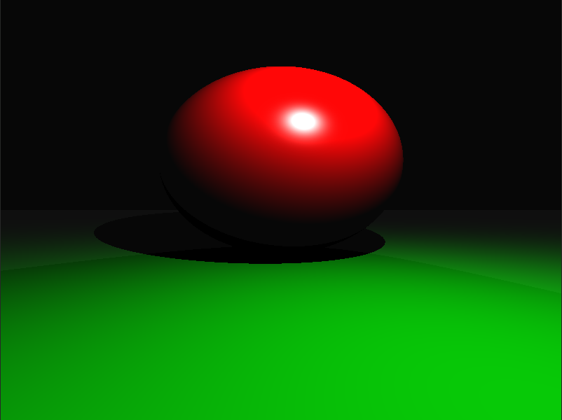

# Introduction
Raycast is a basic raycaster that is capable of projecting images fed in by CSV files.
Projected images are written to disk in a PPM P6 image format.

# Installation
Simply use the Makefile to build all of the project's binaries and libraries.

    make
For a cleaner directory, use the install target to move the binary to a bin directory
and clean up stray object files.

    make install

# Usage
Raycast requires a input CSV file with each object in the scene specified and an output
file name for writing to disk. Additionally, a width and height must be specified to indicate
the size of the output image.

    ./raycast [width] [height] [input] [output]

Example usage:

    ./raycast 800 600 input.csv output.ppm

# Known Issues
None at this time.

# Author
Trey Tangeman   <tct49@nau.edu>
